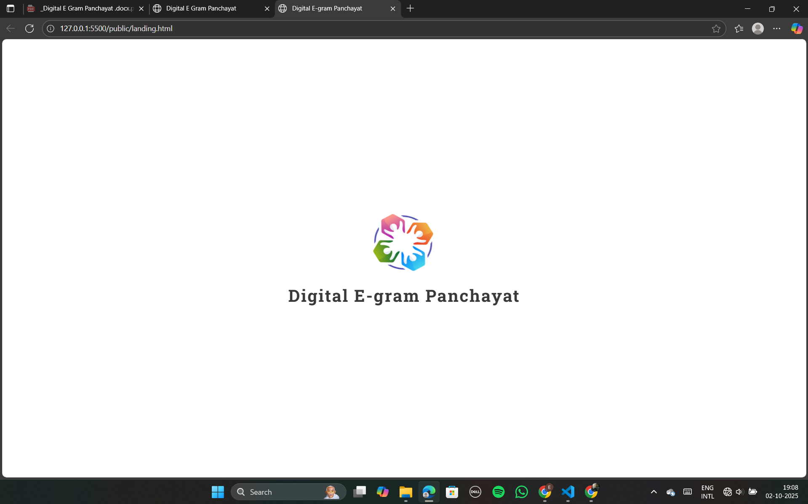
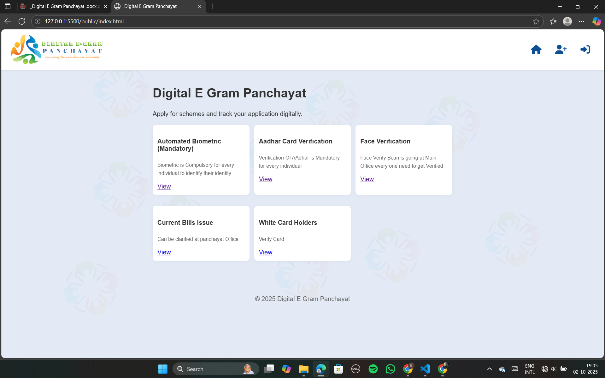
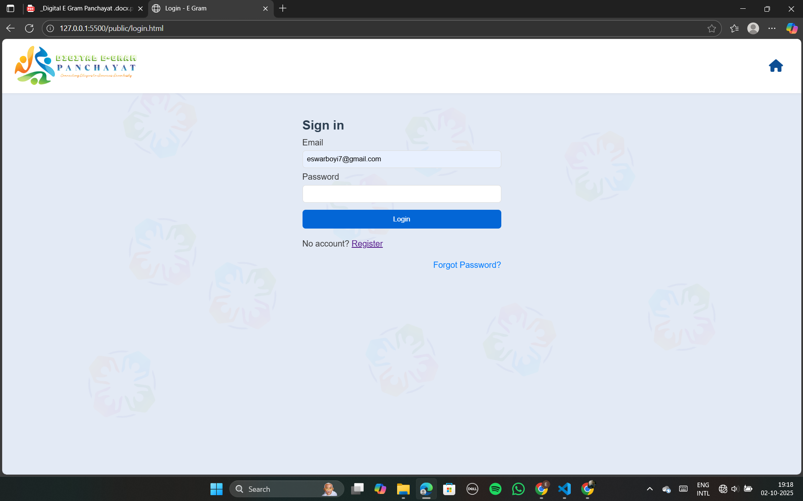
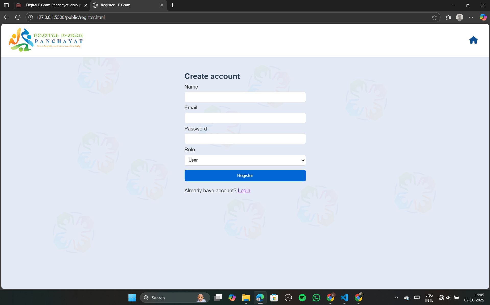
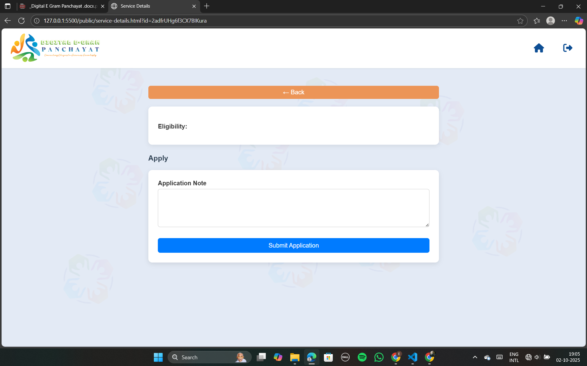
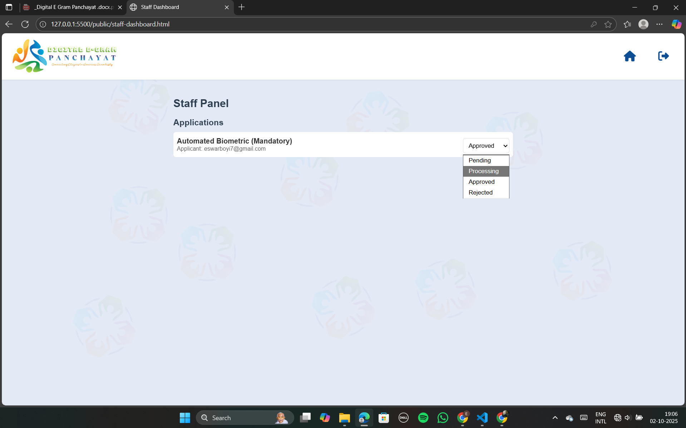
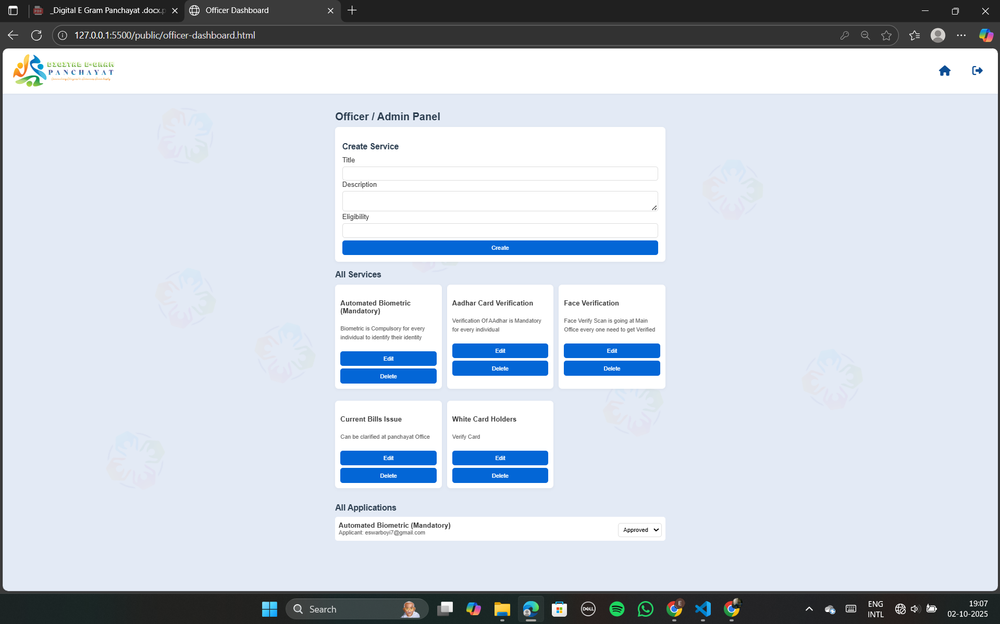

### Digital E-Gram Panchayat Portal

A web-based portal for managing services, applications, and user roles (citizen, staff, officer).  
Built with **HTML, CSS, JavaScript, Firebase Authentication, Firestore, and Hosting**

Live Demo: https://digital-egram.netlify.app/

----------------------------

## Features

- User Authentication (Login, Register, Forgot Password)
- Role-based Access (Citizen, Staff, Officer)
- Firestore Security Rules
- Applications with Status Management
- Continuous Rotating Logo Animations in Background
- Responsive Design

---

## Firebase Setup

1. Go to [Firebase Console](https://console.firebase.google.com/).
2. Create a new project → Enable:
   - **Authentication** → Email/Password
   - **Firestore Database**
   - **Hosting**
3. Update `firebaseConfig` in your JavaScript file (`js/firebase-init.js`):
   ```js
   const firebaseConfig = {
     apiKey: "YOUR_API_KEY",
     authDomain: "YOUR_PROJECT.firebaseapp.com",
     projectId: "YOUR_PROJECT_ID",
     storageBucket: "YOUR_PROJECT.appspot.com",
     messagingSenderId: "SENDER_ID",
     appId: "APP_ID"
   };
   firebase.initializeApp(firebaseConfig);
Firestore Security Rules (example):
````
js
Copy code
rules_version = '2';
service cloud.firestore {
  match /databases/{database}/documents {
    match /users/{userId} {
      allow read, create, update: if request.auth != null && request.auth.uid == userId;
    }
    match /services/{svcId} {
      allow read: if true;
      allow create, update, delete: if isOfficer();
    }
    match /applications/{appId} {
      allow create: if request.auth != null && request.resource.data.applicantUid == request.auth.uid;
      allow read: if request.auth != null && 
        (request.auth.uid == resource.data.applicantUid || isStaffOrOfficer());
      allow update: if isStaffOrOfficer();
      allow delete: if false;
    }
    match /logs/{logId} {
      allow read: if isOfficer();
      allow create: if isStaffOrOfficer();
      allow update, delete: if false;
    }
    function isOfficer() {
      return request.auth != null &&
        get(/databases/$(database)/documents/users/$(request.auth.uid)).data.role == 'officer';
    }
    function isStaffOrOfficer() {
      return request.auth != null && (
        get(/databases/$(database)/documents/users/$(request.auth.uid)).data.role == 'staff' ||
        get(/databases/$(database)/documents/users/$(request.auth.uid)).data.role == 'officer'
      );
    }
  }
}
````
----------

## Deployment
▶ Firebase Hosting
Install Firebase CLI:
````
npm install -g firebase-tools
````

Login:
````
firebase login
````

Initialize Hosting:
````
firebase init hosting
````

Public directory: public

SPA: No

Deploy:
````
firebase deploy
````

---------

###  Netlify Deployment

Go to Netlify.

Create New Site:

Deploy manually: Drag & drop public/ folder
OR

GitHub Deploy: Select repo → Build command (empty) → Publish directory: public


-------------


Running Locally

Open the folder in VS Code.

Use Live Server extension or run:

npx serve public


Visit http://localhost:3000.

---------

### Password Reset

On login page → Forgot Password

Firebase sends reset email automatically (no backend required)

Customize email content from:

Firebase Console → Authentication → Templates → Password Reset

---------

### Screenshots

<table>
  <tr>
    <th> Index Page</th>
    <th> Index Page 2</th>
    <th> Login Page</th>
  </tr>
  <tr>
    <td> </td>
    <td> </td>
    <td> </td>
  </tr>
</table>

<table>
  <tr>
    <th> Register Page</th>
    <th> User Dashboard Page 2</th>
    <th> Application Form Page</th>
  </tr>
  <tr>
    <td> </td>
    <td> </td>
    <td> </td>
  </tr>
</table>

<table>
  <tr>
    <th> Staff Dashboard Page</th>
    <th> Officer/Admin Dashboard Page</th>
    <th> Logo </th>
  </tr>
  <tr>
    <td> </td>
    <td> </td>
    <td> </td>
  </tr>
</table>

-----------------

### License

MIT License © 2025 Digital E-Gram Panchayat
